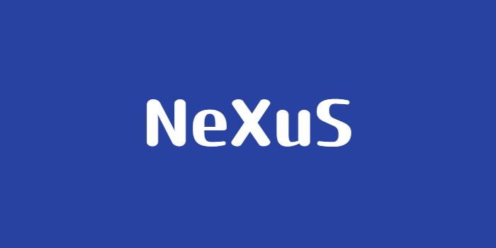

# Answer_Paper_Evaluation_System
A System For Evaluating Student Answer Using State Of The Art NLP Models
___
## Introduction

Nexus is an AI-based Answer Sheet Evaluation System. It automates and accelerates the grading process using advanced Natural Language Processing (NLP) Techniques, offering fast and accurate results. Nexus stands for ${\color{blue}N}$ _eural ${\color{blue}E}$ _valuaotory  e ${\color{blue}X}$ _pert ${\color{blue}U}$ _nified ${\color{blue}S}$ _ystem

> [!NOTE]  
> You Must Have HuggingFace and Streamlit Account For Running This Project

___

## Installation

1. Download the ZIP file, unzip it, and open the resulting folder in your preferred IDE, such as Visual Studio Code.
2. Install the libraries mentioned in [requirements.txt]() 

